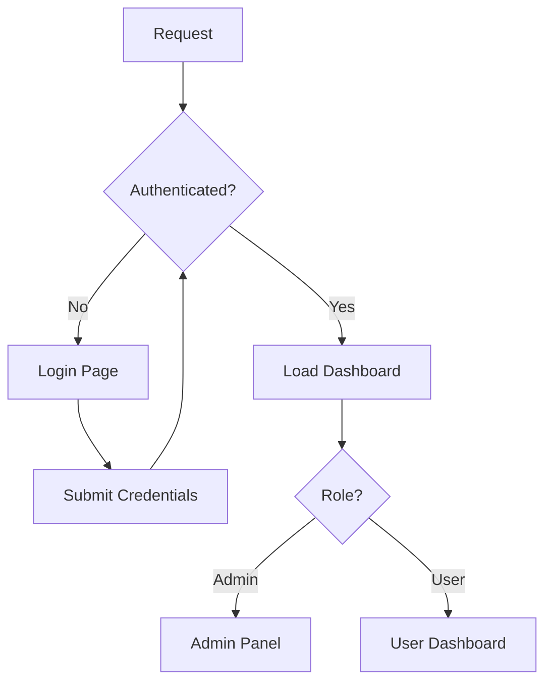
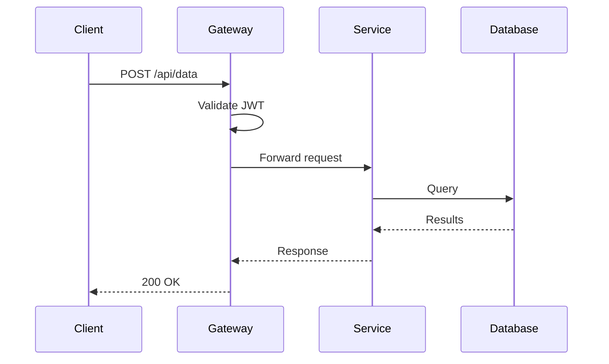
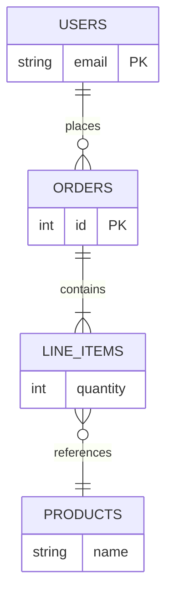
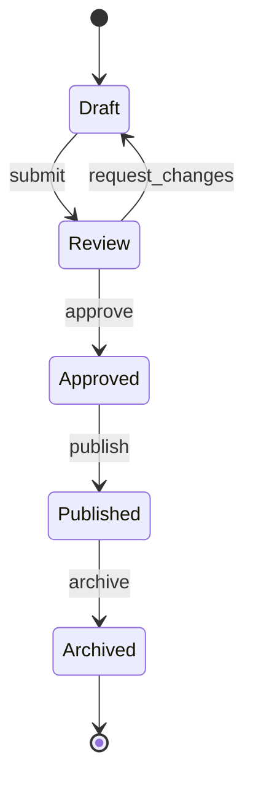
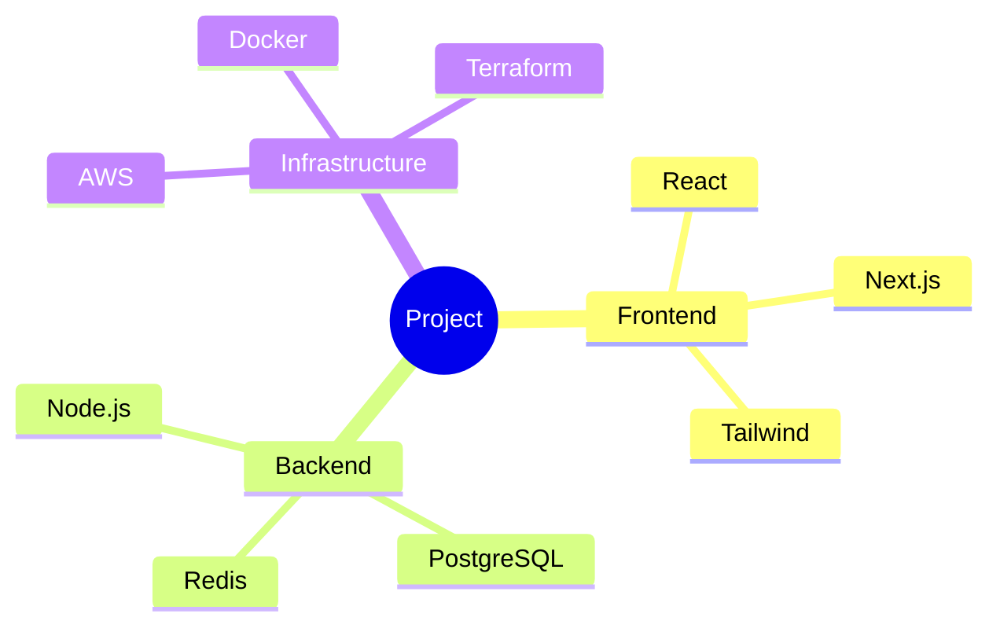
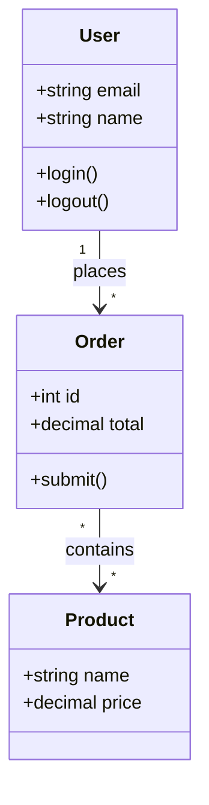
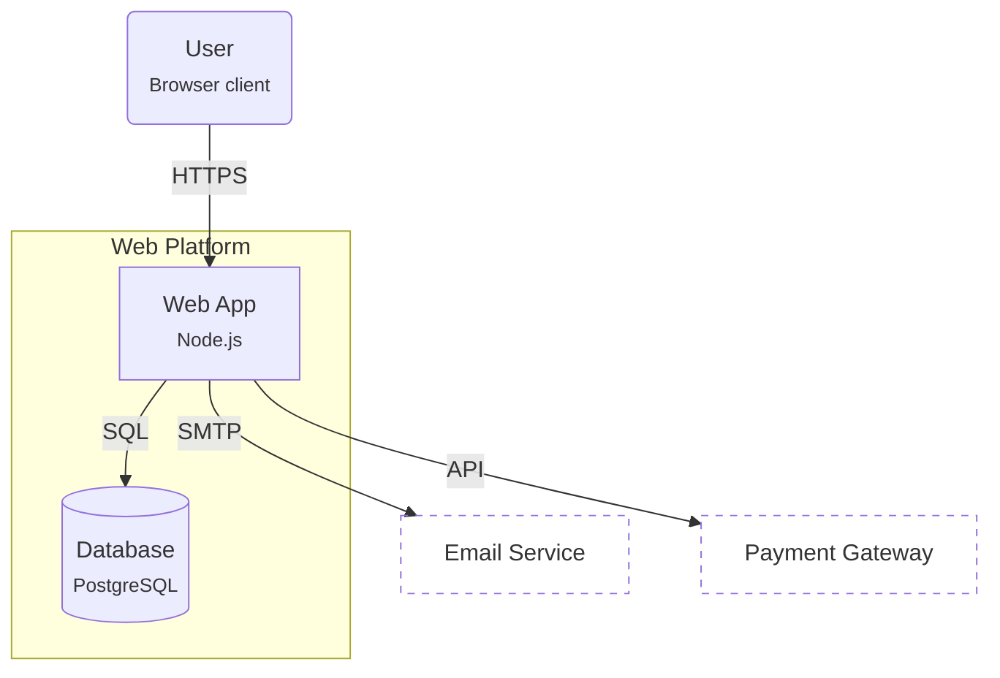

# Mermaid — Complete Guide

The single home for all Mermaid guidance in this skill: when to use it, theming, the required container pattern, zoom/pan/export controls, scaling limits, and syntax caveats. Read this file before writing any Mermaid.

The canonical implementation is `../templates/mermaid-flowchart.html` — the `diagram-shell` HTML structure, CSS, and JS module for zoom/pan/fit/expand/export. Copy it wholesale, then adapt colors and fonts.

**⚠️ Never use bare `<pre class="mermaid">`.** It renders but has no zoom/pan controls, no export controls, and often clips when opened outside the page. Always use the full `diagram-shell` pattern.

## Mermaid.js — Diagramming Engine

Use for flowcharts, sequence diagrams, ER diagrams, state machines, mind maps, class diagrams, and any diagram where automatic node positioning and edge routing saves effort. Mermaid handles layout — you handle theming.

Do NOT use for dashboards — CSS Grid card layouts with Chart.js look better for those. Data tables use `<table>` elements.

**CDN:**
```html
<script type="module">
  import mermaid from 'https://cdn.jsdelivr.net/npm/mermaid@11.6.0/dist/mermaid.esm.min.mjs';

  mermaid.initialize({ startOnLoad: true, /* ... */ });
</script>
```

**With ELK layout** (required for `layout: 'elk'` — it's a separate package, not bundled in core):
```html
<script type="module">
  import mermaid from 'https://cdn.jsdelivr.net/npm/mermaid@11.6.0/dist/mermaid.esm.min.mjs';
  import elkLayouts from 'https://cdn.jsdelivr.net/npm/@mermaid-js/layout-elk@0.1.7/dist/mermaid-layout-elk.esm.min.mjs';

  mermaid.registerLayoutLoaders(elkLayouts);
  mermaid.initialize({ startOnLoad: true, layout: 'elk', /* ... */ });
</script>
```

Without the ELK import and registration, `layout: 'elk'` silently falls back to dagre. Only import ELK when you actually need it — it adds significant bundle weight. Most simple diagrams render fine with dagre.

Pin **both** versions, exactly as above. An unpinned companion package drifts to a release built against a newer Mermaid and the render dies at load time (`Cannot read properties of undefined (reading 'x')`), leaving an empty diagram shell.

### Deep Theming

Always use `theme: 'base'` — it's the only theme where all `themeVariables` are fully customizable. The built-in themes (`default`, `dark`, `forest`, `neutral`) ignore most variable overrides.

```html
<script type="module">
  import mermaid from 'https://cdn.jsdelivr.net/npm/mermaid@11.6.0/dist/mermaid.esm.min.mjs';

  const isDark = window.matchMedia('(prefers-color-scheme: dark)').matches;
  mermaid.initialize({
    startOnLoad: true,
    theme: 'base',
    look: 'classic',
    themeVariables: {
      // Background and surfaces — teal/slate palette (not violet/indigo!)
      primaryColor: isDark ? '#134e4a' : '#ccfbf1',
      primaryBorderColor: isDark ? '#14b8a6' : '#0d9488',
      primaryTextColor: isDark ? '#f0fdfa' : '#134e4a',
      secondaryColor: isDark ? '#1e293b' : '#f0fdf4',
      secondaryBorderColor: isDark ? '#059669' : '#16a34a',
      secondaryTextColor: isDark ? '#f1f5f9' : '#1e293b',
      tertiaryColor: isDark ? '#27201a' : '#fef3c7',
      tertiaryBorderColor: isDark ? '#d97706' : '#f59e0b',
      tertiaryTextColor: isDark ? '#fef3c7' : '#27201a',
      // Lines and edges — edges carry meaning, so they need the 3:1 non-text
      // floor against the container background. #94a3b8 on white is 2.2:1;
      // #64748b is 4.8:1 and still reads as a quiet grey.
      lineColor: isDark ? '#7c8ba1' : '#64748b',
      // Text
      fontSize: '16px',
      fontFamily: 'var(--font-body)',
      // Notes and labels
      noteBkgColor: isDark ? '#1e293b' : '#fefce8',
      noteTextColor: isDark ? '#f1f5f9' : '#1e293b',
      noteBorderColor: isDark ? '#fbbf24' : '#d97706',
    }
  });
</script>
```

**FORBIDDEN in Mermaid themeVariables:** `#8b5cf6`, `#7c3aed`, `#a78bfa` (indigo/violet), `#d946ef` (fuchsia). Use teal, slate, amber, emerald, or colors from your page's palette.

### Node Contrast

Every `*Color` / `*TextColor` pair in `themeVariables` is a fill and the ink that sits on it — the same contract as `--accent-fill` / `--accent-on-fill` in `css-patterns.md`, and it needs the same 4.5:1. The block above follows it: each fill flips between a deep tone (dark mode, light ink) and a pale tone (light mode, dark ink), so no pairing ever ends up light-on-light.

The way this breaks is reaching for a page accent as a node fill. `primaryColor: '#50fa7b'` with `primaryTextColor: '#ffffff'` is 1.4:1 — and because Mermaid initializes once from `isDark`, a mistake here is baked into the SVG rather than corrected by a media query. Pale fills need near-black labels; deep fills need near-white ones.

Node labels are also the smallest text on a page that gets zoomed out, so keep them at the top of the range rather than the floor:

- **Fills** stay pale (`#ccfbf1`, `#fef3c7`) in light mode and deep (`#134e4a`, `#27201a`) in dark — never mid-tone, which fails against both inks.
- **`lineColor`, `primaryBorderColor`, arrowheads** need 3:1 against the container, not against the node fill.
- **`edgeLabel`** sits on `var(--bg)` via the CSS override below, so it's governed by the page's `--text-dim` — which must itself clear 4.5:1.
- **Semi-transparent `classDef` fills** (below) are the safest option: they tint whatever's behind them rather than committing to a tone, and the `.nodeLabel { color: var(--text) }` override keeps the ink correct in both themes.

### CSS Overrides on Mermaid SVG

Mermaid renders SVG. Override its classes for pixel-perfect control that `themeVariables` can't reach:

```css
/* Container — see "Mermaid Containers" below for the full zoom pattern */
.mermaid-wrap {
  position: relative;
  background: var(--surface);
  border: 1px solid var(--border);
  border-radius: 12px;
  padding: 24px;
  overflow: auto;
}

/* CRITICAL: Force node/edge text to follow the page's color scheme.
   Without this, themeVariables.primaryTextColor works for DEFAULT nodes,
   but any classDef that sets color: will hardcode a single value that
   breaks in the opposite color scheme. Fix: never set color: in classDef,
   and always include these CSS overrides. */
.mermaid .nodeLabel { color: var(--text) !important; }
.mermaid .edgeLabel { color: var(--text-dim) !important; background-color: var(--bg) !important; }
.mermaid .edgeLabel rect { fill: var(--bg) !important; }

/* Node shapes */
.mermaid .node rect,
.mermaid .node circle,
.mermaid .node polygon {
  stroke-width: 1.5px;
}

/* Edge paths */
.mermaid .edge-pattern-solid {
  stroke-width: 1.5px;
}

/* Edge labels — smaller than node labels for visual hierarchy */
.mermaid .edgeLabel {
  font-family: var(--font-mono) !important;
  font-size: 13px !important;
}

/* Node labels — 16px default; drop to 14px for complex diagrams (20+ nodes) */
.mermaid .nodeLabel {
  font-family: var(--font-body) !important;
  font-size: 16px !important;
}

/* Sequence diagram actors */
.mermaid .actor {
  stroke-width: 1.5px;
}

/* Sequence diagram messages */
.mermaid .messageText {
  font-family: var(--font-mono) !important;
  font-size: 12px !important;
}

/* ER diagram entities */
.mermaid .er.entityBox {
  stroke-width: 1.5px;
}

/* Mind map nodes */
.mermaid .mindmap-node rect {
  stroke-width: 1.5px;
}
```

### classDef and style Gotchas

`classDef` values and per-node `style` directives are static text inside `<pre>` — they can't use CSS variables or JS ternaries. Two rules:

1. **Never set `color:` in classDef or per-node `style` directives.** It hardcodes a text color that breaks in the opposite color scheme. This applies to both `classDef highlight fill:...,color:#2c2a25` and `style I fill:...,color:#2c2a25`. Let the CSS overrides above handle text color via `var(--text)`.

2. **Use semi-transparent fills (8-digit hex) for node backgrounds.** They layer over whatever Mermaid's base theme background is, producing a tint that works in both light and dark modes. Use `20`–`44` alpha for subtle, `55`–`77` for prominent:

```
classDef highlight fill:#b5761433,stroke:#b57614,stroke-width:2px
classDef muted fill:#7c6f6411,stroke:#7c6f6444,stroke-width:1px
```

### Node Label Special Characters

Mermaid uses certain characters for shape syntax. Node labels containing these characters cause syntax errors unless quoted.

**Shape characters to watch:**
- `[/text/]` — parallelogram
- `[\text\]` — trapezoid (alt)
- `[/text\]` — trapezoid
- `[\text/]` — trapezoid (alt)
- `[(text)]` — cylindrical
- `[[text]]` — subroutine
- `((text))` — circle
- `{{text}}` — hexagon

**If your node label starts with `/`, `\`, `(`, or `{`, wrap it in quotes:**

```
%% WRONG — syntax error (/ starts parallelogram shape)
CMD[/gallery command] --> SRV[server]

%% RIGHT — quotes escape the special character
CMD["/gallery command"] --> SRV[server]
```

**Edge labels with special characters also need quotes:**

```
%% WRONG — quotes inside edge label
UI -->|"Use as Reference"| RET

%% RIGHT — use single quotes or escape
UI -->|'Use as Reference'| RET
UI -->|Use as Reference| RET
```

Avoid opaque light fills like `fill:#fefce8` — they render as bright boxes in dark mode.

### stateDiagram-v2 Label Limitations

State diagram transition labels have a strict parser — colons, parentheses, `<br/>`, HTML entities, and most special characters cause silent parse failures ("Syntax error in text"). Avoid:
- `<br/>` — only works in flowcharts; causes a parse error in state diagrams
- Parentheses in labels — `cancel()` can confuse the parser
- Multiple colons — the first `:` is the label delimiter; extra colons in the label text may break parsing

If your labels need any of these (e.g., `cancel()`, `curate: true`, multi-line labels), use `flowchart TD` instead with rounded nodes and quoted edge labels (`|"label text"|`). Flowcharts handle all special characters and support `<br/>` for line breaks. Reserve `stateDiagram-v2` for simple single-word or plain-text labels.

### Writing Valid Mermaid

Most Mermaid failures come from a few recurring issues. Follow these rules to avoid invalid diagrams:

**For multi-line flowchart node labels, use `<br/>` (not `\n`).** Mermaid flowcharts interpret `<br/>` as a line break, but escaped `\n` in labels often renders as literal text:

```
%% WRONG — renders literal "\n" in node text
A["Copilot Backend\n/api + /api/voicebot"] --> B["Redis"]

%% RIGHT — renders on two lines
A["Copilot Backend<br/>/api + /api/voicebot"] --> B["Redis"]
```

**Quote labels with special characters.** Parentheses, colons, commas, brackets, and ampersands break the parser when unquoted. Wrap any label containing special characters in double quotes:

```
A["handleRequest(ctx)"] --> B["DB: query users"]
A[handleRequest] --> B[query users]
```

**Keep IDs simple.** Node IDs should be alphanumeric with no spaces or punctuation. Put the readable name in the label, not the ID:

```
userSvc["User Service"] --> authSvc["Auth Service"]
```

**Max 10-12 nodes per Mermaid diagram.** Beyond that, readability collapses even with zoom controls and increased fontSize. For complex architectures (15+ elements), use the **hybrid pattern**: a simple 5-8 node Mermaid overview showing module relationships, followed by CSS Grid cards with detailed function lists. Never cram everything into one diagram. Use `subgraph` blocks to group related nodes when under the limit:

```
subgraph Auth
  login --> validate --> token
end
subgraph API
  gateway --> router --> handler
end
Auth --> API
```

**Arrow styles for semantic meaning:**

| Arrow | Meaning | Use for |
|-------|---------|---------|
| `-->` | Solid | Primary flow |
| `-.->` | Dotted | Optional, async, or fallback paths |
| `==>` | Thick | Critical or highlighted path |
| `--x` | Cross | Rejected or blocked |
| `-->\|label\|` | Labeled | Decision branches, data descriptions |

**Escape pipes in labels.** If a label contains a literal `|`, use `#124;` (HTML entity) or rephrase to avoid it — pipes delimit edge labels in flowcharts.

**Sequence diagram messages must be plain text.** Unlike flowchart labels, sequence diagram messages (the text after `:`) cannot be quoted or escaped. Curly braces `{}`, square brackets `[]`, angle brackets `<>`, and `&` will silently break the parser and the entire diagram renders as raw text. Write human-readable descriptions, not code:

```
%% WRONG — parser chokes on braces, brackets, ampersand
A->>B: web_search({ queries: [...] })
B->>B: User removes query 2, keeps 1 & 3
B->>S: POST /submit { selected: [0, 2] }

%% RIGHT — plain English, no special characters
A->>B: Call web_search with queries
B->>B: User removes query 2, keeps 1 and 3
B->>S: POST /submit with selected indices
```

**Don't mix diagram syntax.** Each diagram type has its own syntax. `-->` works in flowcharts but not in sequence diagrams (`->>` instead). `:::className` works in flowcharts but not in ER diagrams. When in doubt, check the examples below for correct syntax per type.

### Layout Direction: TD vs LR

`flowchart LR` (left-to-right) spreads horizontally. With many nodes, Mermaid scales everything down to fit the width, making text unreadable. `flowchart TD` (top-down) is almost always better.

**When to use each:**

| Direction | Use when | Avoid when |
|-----------|----------|------------|
| `TD` (top-down) | Complex diagrams, 5+ nodes, hierarchies, architecture | Simple A→B→C linear flows |
| `LR` (left-to-right) | Simple linear flows, 3-4 nodes, pipelines | Complex graphs, many branches |

**Rule of thumb:** If the diagram has more than one row of nodes or any branching, use `TD`. The extra vertical space makes labels readable.

```
%% WRONG — LR with many nodes produces wide, short, unreadable diagram
flowchart LR
  A --> B --> C --> D --> E
  A --> F --> G --> H
  
%% RIGHT — TD uses vertical space, labels stay readable
flowchart TD
  A --> B --> C --> D --> E
  A --> F --> G --> H
```

### Diagram Type Examples

**⚠️ Every block below is diagram *source* only — not page markup.** Each one belongs inside a `<script type="text/plain" class="diagram-source">` within a `diagram-shell` (see "Full Pattern" below). Never paste one into a bare `<pre class="mermaid">`.

**Flowchart with decisions:**


**Sequence diagram:**


**ER diagram:**


**State diagram:**


**Mind map:**


**Class diagram:**


**C4 architecture (flowchart-as-C4):**


Do NOT use native `C4Context` / `C4Container` syntax — it hardcodes sharp corners, its own font, and inline colors that ignore `themeVariables`. Use `graph TD` + `subgraph` for C4 boundaries instead; it inherits all theme settings automatically.

### Which Mermaid Diagram Type?

Quick-reference for choosing the right Mermaid syntax:

| You want to show... | Use | Syntax keyword |
|---|---|---|
| Process flow, decisions, pipelines | Flowchart | `graph TD` / `graph LR` |
| Request/response, API calls, temporal interactions | Sequence diagram | `sequenceDiagram` |
| Database tables and relationships | ER diagram | `erDiagram` |
| OOP classes, domain models with methods | Class diagram | `classDiagram` |
| System architecture at multiple zoom levels | C4 diagram | `graph TD` + `subgraph` (not native `C4Context`) |
| State transitions, lifecycles | State diagram | `stateDiagram-v2` |
| Hierarchical breakdowns, brainstorms | Mind map | `mindmap` |

### Dark Mode Handling

Mermaid initializes once — it can't reactively switch themes. Read the preference at load time inside your `<script type="module">`:

```javascript
const isDark = window.matchMedia('(prefers-color-scheme: dark)').matches;
// Use isDark to pick light or dark values in themeVariables
```

The CSS overrides on the container (`.mermaid-wrap`) and page will still respond to `prefers-color-scheme` normally — only the Mermaid SVG internals are static.

## Mermaid Containers

Mermaid diagrams have two common layout issues: they render too small to read, and they left-align in their container leaving awkward dead space (especially for narrow vertical flowcharts).

### Centering (Required)

Mermaid SVGs render at a fixed size based on content. Without explicit centering, they default to top-left alignment. **Always center Mermaid diagrams** — narrow vertical flowcharts look particularly bad when left-aligned in a wide container.

```css
/* WRONG — diagram hugs left edge */
.mermaid-container {
  padding: 24px;
  border: 1px solid var(--border);
}

/* RIGHT — diagram centers in container */
.mermaid-wrap {
  display: flex;
  justify-content: center;
  align-items: flex-start;  /* or center for shorter diagrams */
  padding: 24px;
  border: 1px solid var(--border);
}
```

### Default View: The Whole Diagram

**A diagram must open fully visible — never zoomed into a corner.** The `diagram-shell` engine's initial zoom is a pure contain-fit: it scales the SVG down until the entire graph sits inside the container, and only ever scales *up* to `maxInitialZoom` (1.15) so a small diagram doesn't float in dead space. Panning and zooming are for inspecting detail, not for finding the diagram.

This matters because the failure is silent to the author: you know what the diagram contains, so a cropped view still looks like "the diagram" to you. To a reader it opens mid-graph with no indication that anything is off-screen.

Two rules keep this intact when adapting the engine:

- **Never let the initial zoom exceed the contain-fit.** An earlier version of this engine overrode the fit with a width- or height-priority zoom whenever the contain-fit dropped below a readability floor. It meant that the *bigger* the diagram, the more of it was hidden — a tall flowchart opened at 157% showing one slice. Legibility is bought with container height, not by cropping.
- **`maxInitialZoom` is a ceiling, not a target.** Raising it does not make a large diagram more readable; a large diagram is already being scaled *down*, so the ceiling never applies to it. Raising it only blows up small diagrams.

If a diagram is still too small to read once it fits, that is a **complexity problem, not a zoom problem**. Reduce the node count or switch to the hybrid pattern. The engine logs a console hint when a diagram lands under ~35% so this is visible during authoring.

### Scaling Small Diagrams

Mermaid sizes diagrams based on content, not container. Complex diagrams with many nodes render small to fit everything, leaving the text nearly unreadable. Three fixes:

**1. Increase fontSize in themeVariables** (most effective):
```javascript
mermaid.initialize({
  theme: 'base',
  themeVariables: {
    fontSize: '18px',  // default is 16px, bump to 18-20px for complex diagrams
  }
});
```

**2. CSS zoom** for diagrams that still render too small:
```css
.mermaid-wrap--scaled .mermaid {
  zoom: 1.3;
}
```

**3. Constrain container width** so the diagram doesn't float in dead space:
```css
.mermaid-wrap--constrained {
  max-width: 800px;
  margin: 0 auto;
}
```

**Rule of thumb:** If the diagram has 10+ nodes or the text is smaller than 12px rendered, increase fontSize to 18-20px — that enlarges the text *within* the SVG, so it survives being scaled down to fit. Don't reach for `maxInitialZoom`: a 10+ node diagram is being scaled down, so the ceiling never binds, and raising it only affects the small diagrams that didn't need help. For 15+ elements, don't try to scale at all — use the hybrid pattern instead (see "Max 10-12 nodes" above).

The lever that actually helps a large diagram is **container height**. `setAdaptiveHeight()` already sizes the container to the diagram's aspect ratio and grows it toward the viewport cap when the contain-fit would fall below the readability floor — a tall flowchart gets a tall container instead of being squeezed into a short one.

### Zoom Controls

Add zoom controls to every `.mermaid-wrap` container for complex diagrams. This transform-based engine is the **single** pan/zoom implementation for the skill: scrollable pages copy it wholesale from `../templates/mermaid-flowchart.html`. Slide decks don't fork it — on slides, diagrams are click-to-expand only (see `slide-patterns.md`).

**Small diagrams in slides.** If a diagram has fewer than ~7 nodes with no branching, it will render tiny in a full-viewport slide container. For simple linear flows (A → B → C → D), use CSS pipeline cards instead of Mermaid — see `slide-patterns.md` "CSS Pipeline Slide." Reserve Mermaid for complex graphs where automatic edge routing is actually needed.

### Full Pattern

The complete `diagram-shell` implementation — CSS, HTML, and the zoom/pan/fit/expand/export JavaScript — lives in `../templates/mermaid-flowchart.html`. **Copy it wholesale**; it is the single source of truth for this engine. Do not retype it from memory or rebuild it from this summary.

Rules the implementation embodies (verify these survive your adaptation):

- **Structure:** one `.diagram-shell` per diagram. The Mermaid source lives in `<script type="text/plain" class="diagram-source">` so multiple diagrams coexist without ID collisions; the SVG renders into `.mermaid-canvas`, absolutely positioned inside an `overflow: hidden` `.mermaid-viewport`. Zoom sets the SVG's width/height directly; pan applies `transform: translate()` to the canvas (never CSS `zoom` — cross-browser quirks).
- **Centering + height:** `.mermaid-wrap` uses flex centering with `min-height: 400px` (`--compact` 200px, `--tall` 600px) so vertical flowcharts never compress into thumbnails.
- **Controls:** the button cluster (`+`, `−`, fit, 1:1, ⛶ expand, WebP) uses `data-action` attributes wired by `initDiagram(shell)`; every glyph button carries both `title` and `aria-label`. The `.zoom-label` reports `% — mode` and doubles as the error surface when a render fails.
- **State:** per-diagram state lives in the `initDiagram` closure; only shared drag listeners sit at module scope. No hardcoded element IDs anywhere.
- **Interaction:** plain wheel always scrolls the page; Ctrl/Cmd+wheel zooms around the cursor; drag pans when zoomed; double-click re-fits. `cursor: grab`/`grabbing` signals pan availability.
- **Initial view:** contain-fit, always — the whole diagram visible on load, capped at `maxInitialZoom` for upscaling only. The zoom label reads `NN% — fit` (or `capped` when a small diagram hit the ceiling). If you see a percentage above 100 on anything but a tiny diagram, the fit logic has been broken in adaptation.

## Export Controls and Export Safety

Every `.mermaid-wrap` container gets the full zoom cluster (`+`, `−`, fit, 1:1, ⛶ expand) **plus a `WebP` export button** — there is no separate "reset"; fit *is* the reset. Export controls must have width driven by their label (`width: auto; min-width: 62px; padding: 0 10px;`) so button text never clips. Include JavaScript so the ⛶ button opens a padded full-size SVG clone in a new tab, and the `WebP` button downloads a padded canvas-rendered `.webp` of the diagram.

Prefer `flowchart: { htmlLabels: false }` for flowcharts that may be expanded or exported — HTML labels often clip when serialized to SVG, opened in a new tab, or drawn to canvas. Keep labels short and manually line-break them with `<br/>`.

When expanding or exporting:
- Clone the rendered SVG and add `xmlns`
- Set an expanded `viewBox` with generous padding (at least 120px for full-screen, 160px for WebP export)
- Prepend a background `<rect>`
- Inject an SVG `<style>` block that sets the same body/mono fonts used by the page
- Use the SVG `viewBox` when available instead of `getBBox()` alone, so bottom text and edge labels are not cropped by a too-tight export box

Test the expanded tab and WebP output before delivering: both must preserve the page fonts, include a background, and show all node text without clipping the top or bottom line.

## Page-Level CSS Class Collision

**Never define `.node` as a page-level CSS class.** Mermaid uses `.node` internally on SVG `<g>` elements with `transform: translate(x, y)` for positioning. Page-level `.node` styles (hover transforms, box-shadows) leak into diagrams and break layout. Use the namespaced `.hc-card` class for card components instead. The only safe way to style Mermaid's `.node` is scoped under `.mermaid` (e.g., `.mermaid .node rect`).
